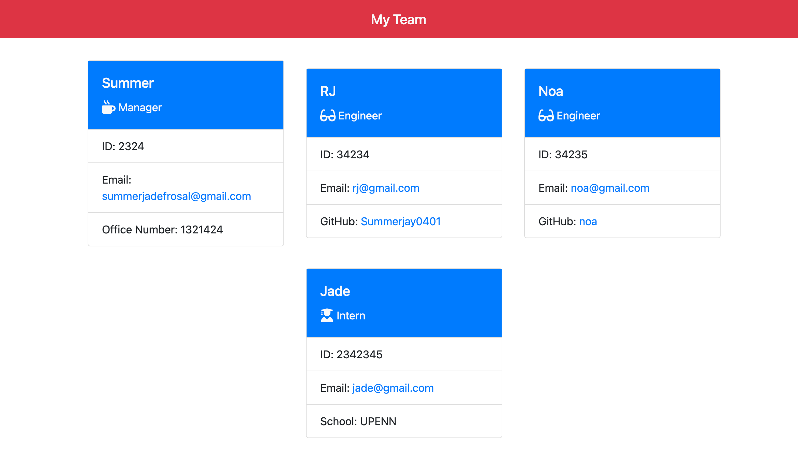

# team-profile-generator-OOP

## Description

Generate your team profile with this amazing tool.

## Install Packages

* npm i

## Usage

1. npm run start
2. index.html will be generated in dist folder

## Screenshots

## Demo in Google Drive
[Watch the demo video](https://drive.google.com/file/d/1vbWT35Sw6swYMlZ5NUlRBrDYy8j8NEzG/view?usp=sharing)

# About me
* Find me on GitHub: https://github.com/Summerjay0401
* E-mail: summerjadefrosal@gmail.com

# by Summer Jade Rosal